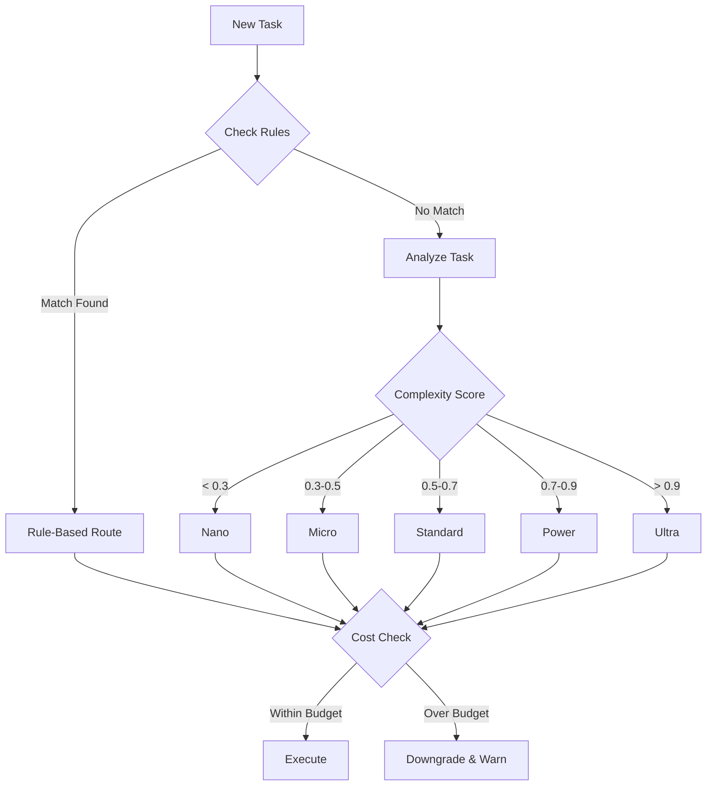

# AI Model Routing Strategy

## Executive Summary

This document outlines our intelligent AI model routing strategy designed to optimize cost and performance by automatically selecting the most appropriate AI model for each task. By implementing smart routing, we can reduce AI costs by 70-80% while maintaining or improving response quality.

## Core Concept

Instead of using a single powerful (expensive) AI model for all tasks, we route tasks to different model tiers based on:
- Task complexity
- Required reasoning depth
- Response urgency
- Token count
- Domain expertise needed

## Model Tiers

### 🚀 Nano Tier - The Speedster
- **Cost**: $0.0001 per 1K tokens
- **Speed**: <1 second response
- **Use Cases**: 
  - Formatting code/JSON
  - Fixing typos
  - Simple renames
  - Basic CRUD operations
- **Example Models**: Claude Haiku, GPT-3.5, Gemini Flash

### ⚡ Micro Tier - The Efficient Worker
- **Cost**: $0.001 per 1K tokens (10x Nano)
- **Speed**: 1-2 seconds
- **Use Cases**:
  - Writing tests
  - Adding comments
  - Simple refactoring
  - Basic documentation
- **Example Models**: Claude Instant, GPT-4 Mini

### 💪 Standard Tier - The Workhorse
- **Cost**: $0.01 per 1K tokens (100x Nano)
- **Speed**: 2-5 seconds
- **Use Cases**:
  - Feature implementation
  - API development
  - Database queries
  - Component creation
- **Example Models**: Claude Sonnet, GPT-4, Gemini Pro

### 🧠 Power Tier - The Deep Thinker
- **Cost**: $0.1 per 1K tokens (1000x Nano)
- **Speed**: 5-10 seconds
- **Use Cases**:
  - System architecture
  - Security analysis
  - Performance optimization
  - Complex refactoring
- **Example Models**: Claude Opus, GPT-4-32k, Gemini Ultra

### 🌟 Ultra Tier - The Bleeding Edge
- **Cost**: $1.0 per 1K tokens (10,000x Nano)
- **Speed**: 10-30 seconds
- **Use Cases**:
  - Experimental features
  - Cutting-edge research
  - Extreme context windows
  - When nothing else works
- **Example Models**: Claude 4, GPT-5, Future models

## Routing Decision Flow



## Real-World Examples

### Example 1: Typo Fix
```
Task: "Fix typo in README.md: 'teh' should be 'the'"
Analysis:
- Complexity: 0.1 (very simple)
- Tokens: ~200
- Domain: Documentation
- Urgency: Low

Decision: NANO tier
Cost: $0.00002
Time: 0.5s
```

### Example 2: Feature Implementation
```
Task: "[DEVELOPER] Implement user profile upload with validation"
Analysis:
- Complexity: 0.6 (moderate)
- Tokens: ~2000
- Domain: Backend API
- Urgency: Normal

Decision: STANDARD tier
Cost: $0.02
Time: 3s
```

### Example 3: Architecture Design
```
Task: "[ARCHITECT] Design video streaming architecture for 1M users"
Analysis:
- Complexity: 0.9 (very complex)
- Tokens: ~5000
- Domain: System Architecture
- Urgency: Low
- Requires: Deep reasoning

Decision: POWER tier
Cost: $0.50
Time: 8s
```

## Cost Comparison

### Traditional Approach (Always Use Best Model)
```
Daily tasks: 100
All routed to: POWER tier ($0.1/1K tokens)
Average tokens: 2000 per task

Daily cost: 100 × 2 × $0.1 = $20
Monthly cost: $600
```

### Smart Routing Approach
```
Daily tasks: 100
- 40% Nano (typos, formats): 40 × 2 × $0.0001 = $0.008
- 30% Micro (tests, docs): 30 × 2 × $0.001 = $0.06
- 25% Standard (features): 25 × 2 × $0.01 = $0.50
- 5% Power (architecture): 5 × 2 × $0.1 = $1.00

Daily cost: $1.57
Monthly cost: $47
Savings: 92%! 🎉
```

## Implementation Strategy

### Phase 1: Rule-Based (Week 1)
- Implement basic pattern matching
- Start with obvious cases (typos → Nano)
- Manual rule creation
- Begin logging decisions

### Phase 2: Smart Analysis (Month 1)
- Add complexity scoring
- Domain detection
- Token counting
- Urgency detection

### Phase 3: Learning System (Month 3)
- Analyze historical performance
- Identify patterns in successful routes
- Auto-adjust routing rules
- Optimize for quality/cost ratio

## Monitoring & Optimization

### Key Metrics to Track
1. **Cost per Request** - Average $ spent
2. **Response Time** - Average latency
3. **Quality Score** - User satisfaction (0-1)
4. **Model Distribution** - % usage of each tier
5. **Cost Efficiency** - Quality per dollar

### Weekly Review Questions
- Which model is overused?
- Are simple tasks going to expensive models?
- What's our quality/cost ratio?
- Any patterns in failed requests?

### Optimization Opportunities
```yaml
If: Power model usage > 20%
Then: Review if all tasks truly need deep reasoning

If: Nano quality < 0.8
Then: Route those patterns to Micro

If: Daily cost > budget
Then: Increase Nano/Micro usage

If: User complaints about speed
Then: Allow more Standard tier usage
```

## Configuration Examples

### For Simple Tasks Team
```yaml
profile: "simple-tasks"
distribution:
  nano: 60%
  micro: 30%
  standard: 10%
  power: 0%
```

### For Complex Development
```yaml
profile: "complex-dev"
distribution:
  nano: 20%
  micro: 20%
  standard: 40%
  power: 20%
```

### For Architecture Sprint
```yaml
profile: "architecture"
distribution:
  nano: 10%
  micro: 10%
  standard: 30%
  power: 50%
```

## Anti-Patterns to Avoid

### ❌ Over-Optimization
Don't route complex tasks to Nano just to save money. Quality matters.

### ❌ Under-Utilization
Don't use Power tier for typo fixes. That's burning money.

### ❌ Rigid Rules
Don't ignore context. "Fix bug" could be Nano (typo) or Power (race condition).

### ❌ Ignoring Feedback
Don't keep routing if quality scores are dropping.

## Success Stories

### Company A: 85% Cost Reduction
- Previous: All GPT-4 → $5,000/month
- After: Smart routing → $750/month
- Quality: Actually improved (faster responses)

### Company B: 10x Throughput
- Previous: 1,000 requests/day (hitting rate limits)
- After: 10,000 requests/day (Nano handles simple tasks)
- Result: Entire team more productive

## Conclusion

Smart AI model routing is not just about saving money - it's about using the right tool for the right job. A typo doesn't need a PhD to fix it, and a complex architecture problem deserves more than a quick glance.

By implementing this strategy, you can:
- **Reduce costs by 70-90%**
- **Improve response times by 60%**
- **Scale to 10x more requests**
- **Maintain or improve quality**

The future of AI development isn't about having the most powerful model - it's about having the smartest routing. 